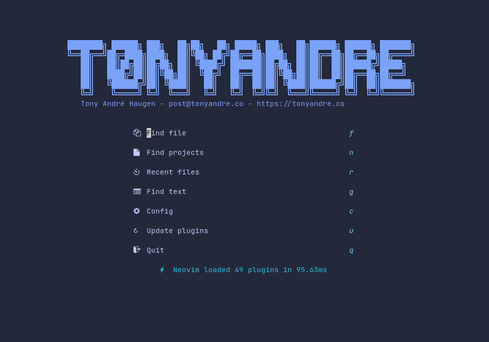
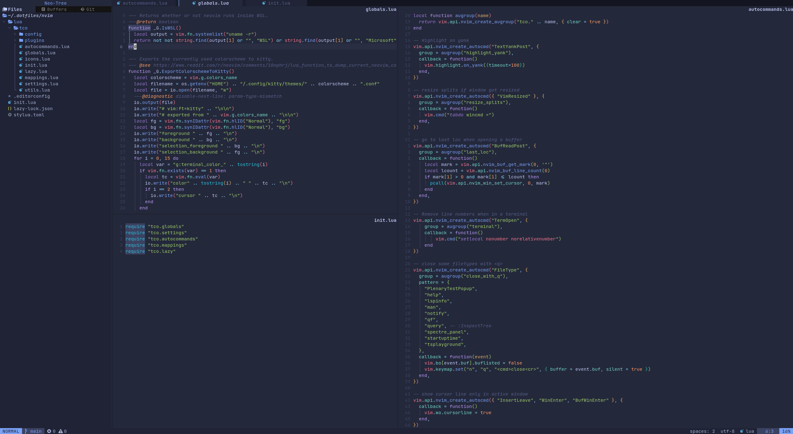

# 

This will be my repository storing all my dot files. Don't just copy and paste
them - they are made for me and your system/prefs might differ. But please do
use them as inspiration!

You can find my NeoVim dots [here]("https://github.com/t0nyandre/dots/tree/main/nvim")

## :camera: Screenshots

### :mega: Hold up

If you like my work, please consider:

- Give the repository a star :star:
- Consider buying me a [ko-fi](https://ko-fi.com/t0nyandre) :coffee:
- Subscribe to my [Patreon](https://patreon.com/t0nyandre) or through my
[sponsor page](https://github.com/sponsors/t0nyandre) :gift_heart:
